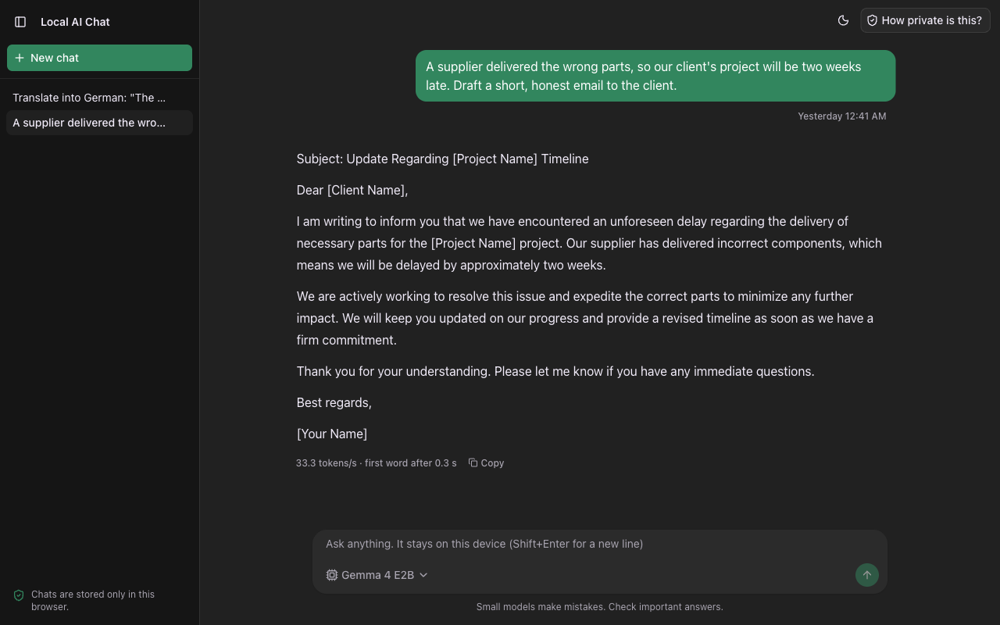
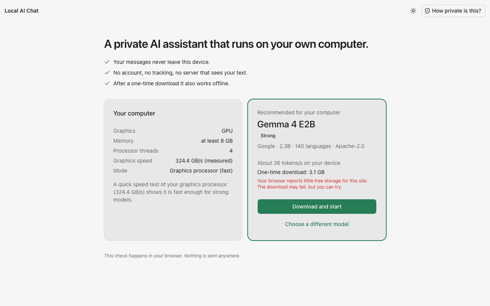
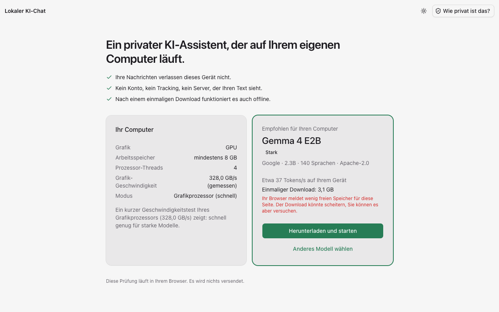
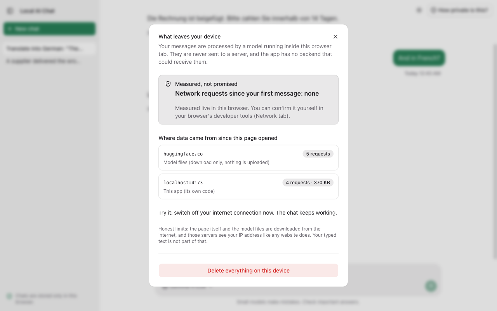
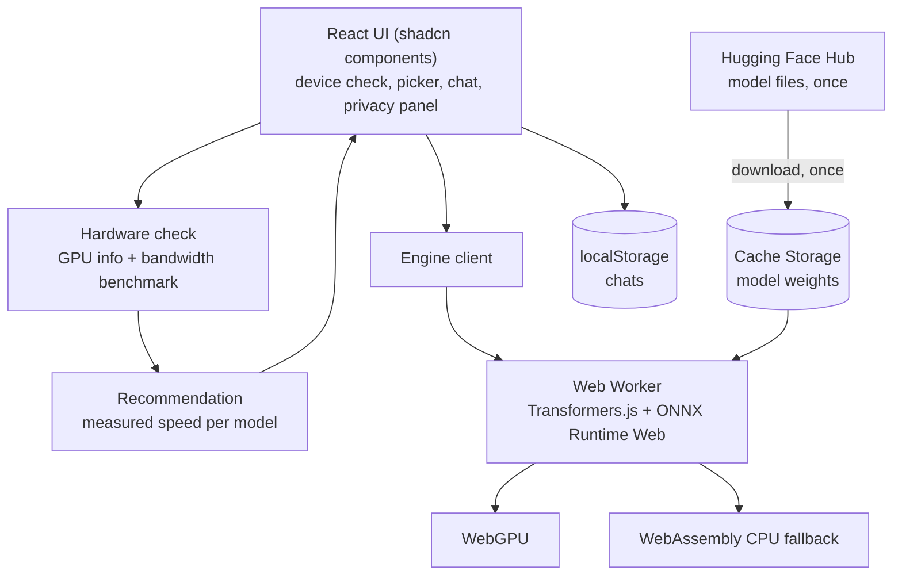

# Local AI Chat

A private AI chat that runs the language model **on your own device**. Nothing you type leaves the
browser: there is no backend, no account and no tracking. It checks your computer, picks a model that
fits, and shows a live counter of network requests so the privacy claim can be verified instead of
trusted.

**Live demo: [local-ai-chat.philippmossier.com](https://local-ai-chat.philippmossier.com)** (needs a browser with WebGPU;
the first model download is 570 MB to 4.9 GB, straight from Hugging Face).



Built for people who cannot or do not want to send text to a US cloud service: European organisations
with data protection concerns, or anyone who wants to see what today's open models do locally.
[`docs/for-it-and-compliance.md`](docs/for-it-and-compliance.md) is the page for the person who has to
approve it.

## What it does

- **Checks your computer in the browser** (GPU, memory, a half-second GPU speed test) and explains the
  result in plain language. The interface is German or English, chosen from the browser's language
  setting (see "Why no i18n library" below).
- **Recommends one model and starts it with one click.** Four Apache-2.0 models, from 570 MB to 4.9 GB.
  Advanced users can pick another one.
- **Runs the model on the GPU through WebGPU**, falling back to the CPU through WebAssembly.
- **Corrects itself.** After the first real answer it compares the measured speed with the estimate and
  suggests a lighter or a stronger model.
- **Shows what leaves the device.** A panel counts every network request since your first message
  (expected: none), and a Content-Security-Policy blocks requests to anything except the page's own origin
  and the Hugging Face Hub (model downloads). What the policy does not cover (navigation, uploads to the
  allowed host) is listed in [for-it-and-compliance](docs/for-it-and-compliance.md#what-the-policy-does-not-cover).
- **Works offline** once the model is cached. Chats stay in the browser; one button deletes everything.

First visit: the hardware check and the recommended model.



The same screen in a browser set to German (`de`, `de-AT`, `de-CH`):





## Measured

One machine: a MacBook with an Apple M1 Max (about 310 GB/s measured GPU memory bandwidth once warm), Brave
(Chromium 154), WebGPU, 2026-10-05, text-only chat, `q4f16` weights. Speed is the decode speed during
a 150-word answer.

| Model       | Tier         | Download | Speed       | First word   | Notes                                                             |
| ----------- | ------------ | -------- | ----------- | ------------ | ----------------------------------------------------------------- |
| Qwen3 0.6B  | Light        | 570 MB   | 73 tokens/s | 0.1 to 0.3 s | German output has visible grammar errors                          |
| Qwen3 1.7B  | Balanced     | 1.4 GB   | 18 tokens/s | 0.2 s        | Needs the 64-bit runtime (see below)                              |
| Gemma 4 E2B | Strong       | 3.1 GB   | 35 tokens/s | 0.4 s        | Fluent English. 2.3B effective parameters                         |
| Gemma 4 E4B | Best quality | 4.9 GB   | 23 tokens/s | 0.3 s        | Fluent German; 4.5B effective parameters; loads from cache in 7 s |

Also verified on that machine: the production build under the strict Content-Security-Policy (no
violations), the German interface, and a reply with the network switched off (`navigator.onLine` was
false; it answered at 23.7 tokens/s).

**Not tested:** Intel Macs, Windows, Linux, Firefox, Safari, phones, and the CPU (WebAssembly) path. The
code for them exists and has unit tests (hardware profiles for each), but I have not run them on real
hardware. Treat those paths as unverified until someone does.

## How it works



Decisions are written down as ADRs in [`docs/adr/`](docs/adr):

1. [Transformers.js in a worker](docs/adr/0001-transformers-js-in-a-worker.md)
2. [Measure the GPU instead of guessing from its name](docs/adr/0002-measure-the-gpu-do-not-guess-from-its-name.md)
3. [Make the privacy claim checkable](docs/adr/0003-make-the-privacy-claim-checkable.md)
4. [A short ladder of Apache-licensed models](docs/adr/0004-a-short-ladder-of-apache-licensed-models.md)
5. [Chats in localStorage, models in Cache Storage](docs/adr/0005-local-storage-for-chats-cache-storage-for-models.md)
6. [No i18n library: text next to the code](docs/adr/0006-no-i18n-library-text-next-to-the-code.md)
7. [shadcn components, including the chat primitives](docs/adr/0007-shadcn-components-including-the-chat-primitives.md)

### Things I ran into (and what the code does about them)

- **Browsers hide the GPU.** Brave returned empty vendor and architecture strings, 4 CPU threads on a
  10-core machine, and a 2 GB storage quota on a disk with 250 GB free. A vendor lookup table would have
  been useless, so the app measures memory bandwidth instead (generation is memory bound) and treats
  vendor, thread count and quota as hints.
- **The measurement itself is noisy.** On cold page loads the same GPU read 150 to 313 GB/s, because of
  its power state; repeated runs in one warm page spread only 5%. The test ramps the GPU up for 250 ms,
  sizes each trial to about 40 ms and takes a median, and the recommendation keeps margin: even at the
  low reading, Gemma 4 E2B stays above 15 tokens/s on the test machine. The speed of the first real
  answer corrects any remaining error.
- **A size formula was wrong.** Speed predicted from model size alone put Qwen3 1.7B level with Gemma 4
  E2B; measured, it was half as fast. The estimator now uses each model's measured speed, scaled by
  the GPU's measured bandwidth.
- **A 1.4 GB single-file model failed to load** with `std::bad_alloc` on the default 32-bit WebAssembly
  runtime. The app uses the 64-bit JSPI build where the browser has it (Chromium) and the 32-bit one
  elsewhere, where larger single-file models may still fail.
- **By default the runtime loads its engine from a public CDN.** That would be a third-party request on
  every visit and would break the CSP, so the files are copied into the app and served from the same
  origin (`scripts/copy-ort.mjs`).
- **Gemma 4 is a multimodal model.** Loading it through the causal-LM class makes Transformers.js skip
  the vision and audio encoders, so a text chat downloads 3.1 GB instead of 3.4 GB or more.
- **Gemma writes LaTeX for chemistry.** The system prompt asks for plain text.

## Built with

React 19, Vite, Tailwind 4 and **shadcn/ui** (`base-vega` style on Base UI, neutral theme, emerald `--primary`,
lucide icons): chat thread (`MessageScroller`, `Message`, `Bubble`), history (`Sidebar`, a sheet on phones),
composer (`InputGroup`), dialogs (`Dialog`, `AlertDialog`), and the model engine in a Web Worker
(Transformers.js). Light, dark or the system setting (menu top right, remembered in the browser). Notes on the chat scroller: [ARCHITECTURE](docs/ARCHITECTURE.md#the-chat-area).

## Why no i18n library

The interface is shown in German or English, picked once from the browser's language list (any German
variant gives German, everything else English). I decided against an i18n library, dictionary files,
a language context and a language switch on purpose: with two languages and about 100 short strings, that is
more machinery than text.

Instead each string sits next to the code that shows it, as `tr("English", "Deutsch")`
([`src/lib/lang.ts`](src/lib/lang.ts), 24 lines). Text that depends on a value (a tier, a fit, a reason) is
a lookup in [`src/lib/labels.ts`](src/lib/labels.ts) that the compiler checks for completeness. Forgetting
the German text is a type error, because `tr` takes both.

What this costs, honestly: no plural rules and no third language without touching every call site; no
translator workflow; no way to override the language by hand (change the browser setting and reload);
numbers are formatted per language only where it matters (`decimal` in `src/lib/format.ts`). If a third
language or a translator ever shows up, that is the moment to introduce a library.
See [ADR 6](docs/adr/0006-no-i18n-library-text-next-to-the-code.md).

## Run it

```bash
pnpm install
pnpm dev                  # http://localhost:5173 (cross-origin isolation on; the CSP is production-only)
```

Use a recent Chromium browser (Chrome, Edge, Brave) for the GPU path. WebGPU needs `https` or `localhost`.

```bash
pnpm test                 # hardware classification and recommendation, speed estimate, language detection, chat state, network summary
pnpm check-types && pnpm lint
pnpm build && pnpm preview   # production build, with the Content-Security-Policy applied
```

## Deploying

The output of `pnpm build` is static files (about 80 MB, almost all of it the WebAssembly runtime).
Any static host works if it sends the headers in `dist/_headers`, which the build generates (Netlify and
Cloudflare Pages read that file as is):

- `Content-Security-Policy`: the allowlist described above. **Send it as a header, not only the meta tag:**
  the model runs in a Web Worker, and a worker takes its policy from its own response headers. On a host that
  ignores `_headers` (GitHub Pages, plain S3), the worker would run without any policy,
- `Cross-Origin-Opener-Policy: same-origin` and `Cross-Origin-Embedder-Policy: require-corp`, which allow
  multi-threaded WebAssembly,
- long-lived caching for `/ort/*`.

Most static hosts limit the size of one file (Cloudflare: 25 MiB). The runtime build for browsers without
JSPI is about 27 MB, so `scripts/copy-ort.mjs` stores it as two parts and the worker joins them; the copy Vite
would bundle is dropped from the build. The live demo is deployed with
`pnpm deploy:cloudflare`: static files only, served by Cloudflare with the headers from `dist/_headers`
(`wrangler.jsonc`).

Model files are fetched by the visitor's browser straight from Hugging Face; your host never serves them.

## Documentation

| Document                                                       | Read it for                                                                |
| -------------------------------------------------------------- | -------------------------------------------------------------------------- |
| [docs/ARCHITECTURE.md](docs/ARCHITECTURE.md)                   | How it is built, module map, the stage flow, how to add a model, testing   |
| [docs/REVIEW-GUIDE.md](docs/REVIEW-GUIDE.md)                   | A map for reviewers: claims and evidence, known weak spots, open decisions |
| [docs/for-it-and-compliance.md](docs/for-it-and-compliance.md) | What data goes where, for the person who approves it                       |
| [docs/adr/](docs/adr)                                          | The decisions                                                              |
| [CLAUDE.md](CLAUDE.md)                                         | Instructions for AI assistants working in the repo                         |

## Not here yet

- **Verification on other hardware and browsers** (see Measured). The most valuable contribution.
- **Offline cold start.** A returning visitor with the model cached can chat offline once the page is
  open, but opening the page itself offline needs a service worker for the app shell.
- **A self-hosted model mirror** for organisations that cannot allow Hugging Face at all.
- **Your own server as a second engine.** For larger models than a laptop can run, the chat could talk
  to an OpenAI-compatible endpoint inside the organisation (Ollama, vLLM, LM Studio) instead of the
  browser. The data would then leave the device but not the organisation's network. The app reaches the
  model only through `EngineClient` (`src/lib/engine/client.ts`), so this means extracting an interface
  from it and adding an HTTP implementation, not a rewrite. The privacy panel and the CSP would have to
  name that host.
- **Conversation memory beyond the context window.** Older turns are dropped once the prompt would
  exceed 4096 tokens.
- **A manual language switch.** Deliberately left out, see above.
- **A second engine and newer models.** WebLLM (MLC) offers grammar-constrained JSON, and Qwen3.5
  (0.8B, 2B, 4B) has ONNX builds on the Hub that could replace the Qwen3 tiers. Neither is tried here.
- **Quality evaluation.** Speeds are measured, answer quality is not. Small models make mistakes, and the
  UI says so.

## License

MIT for the code. The models are Apache-2.0 (Qwen3 by Alibaba, Gemma 4 by Google); check the terms for your
use.
