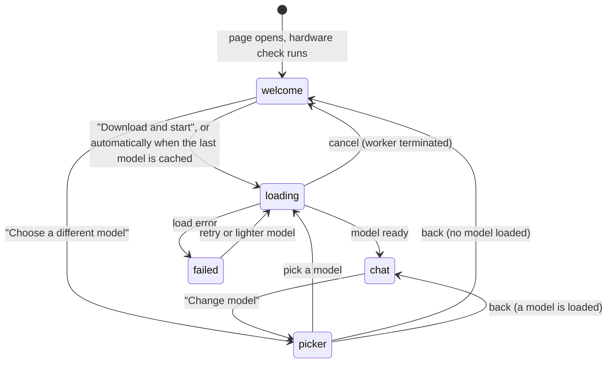

# Architecture

How Local AI Chat is put together. It is a static single-page app: there is no server code at all, which is the
point (see [for-it-and-compliance](for-it-and-compliance.md)).

## The flow a user sees

`App.tsx` owns this state machine (`Stage`), the chat state (a reducer), the hardware profile and the engine. It
is the only place that coordinates things; the components are presentational.

## Modules

| Path                                        | Responsibility                                                                                                                                                                                          |
| ------------------------------------------- | ------------------------------------------------------------------------------------------------------------------------------------------------------------------------------------------------------- |
| `src/App.tsx`                               | Stage machine, chat send/stream loop, speed advice, wipe handling                                                                                                                                       |
| `src/components/`                           | Screens and chat parts built from shadcn components: welcome, model picker, loading, chat, chat sidebar, composer, message, greeting, privacy dialog, advice banner, header, theme menu, sidebar chrome |
| `src/components/ui/`                        | shadcn components (generated by the CLI, `base-vega` style). Not hand-edited, except the fixes listed under "The chat area"                                                                             |
| `src/lib/hardware/detect.ts`                | Reads what the browser exposes: GPU adapter, features, memory, threads, storage, platform                                                                                                               |
| `src/lib/hardware/bandwidth.ts`             | **GPU memory-bandwidth benchmark** (WebGPU compute shader, 256 MB buffer, ramp-up, median of 5)                                                                                                         |
| `src/lib/hardware/classify.ts`              | Sorts a machine into strong GPU / basic GPU / CPU only / unsupported, with typed reason ids                                                                                                             |
| `src/lib/hardware/estimate.ts`              | Expected tokens/s per model from measured bandwidth                                                                                                                                                     |
| `src/lib/hardware/recommend.ts`             | The recommendation: per model fit, the one-click pick, backend (device + weight format)                                                                                                                 |
| `src/lib/hardware/advice.ts`                | After the first answer: compare measured speed with the estimate, suggest one step up or down                                                                                                           |
| `src/lib/hardware/fixtures.ts`              | Representative machines for tests (Apple chip, Intel Mac, RTX, no WebGPU, phone, hidden vendor...)                                                                                                      |
| `src/lib/models/catalog.ts`                 | The four models: repo, pinned revision, download and read sizes, measured reference speed                                                                                                               |
| `src/lib/engine/`                           | `worker.ts` (Transformers.js, runs the model), `client.ts` (main-thread handle), `protocol.ts` (messages), `singleton.ts`                                                                               |
| `src/lib/chat/store.ts`                     | Chat reducer and `localStorage` persistence that tolerates corrupt data                                                                                                                                 |
| `src/lib/privacy/`                          | Network request summary, the live hook, "delete everything", model cache check                                                                                                                          |
| `src/lib/lang.ts`, `labels.ts`, `format.ts` | Language detection and `tr()`, exhaustive run-time labels, number formatting                                                                                                                            |
| `scripts/copy-ort.mjs`                      | Copies the WebAssembly runtime into `public/ort` so it is served from this origin                                                                                                                       |
| `vite.config.ts`                            | The Content-Security-Policy, cross-origin isolation headers, `_headers` file                                                                                                                            |

## Model selection, in order

1. **Detect** (`detect.ts`): GPU adapter info (often empty in privacy-minded browsers), `shader-f16`, buffer
   limit, memory (capped at 8 by browsers), threads, platform, storage estimate.
2. **Measure** (`bandwidth.ts`): how fast the GPU reads memory. Generation is memory bound, so this predicts
   tokens per second better than any name ([ADR 2](adr/0002-measure-the-gpu-do-not-guess-from-its-name.md)).
3. **Classify** (`classify.ts`): the measurement wins over the vendor name. Memory and mobile caps lower the
   largest tier offered. No WebGPU or a software renderer means the CPU path.
4. **Recommend** (`recommend.ts`): with a measurement, each model's expected speed
   (`referenceTps * bandwidth / referenceBandwidth`) decides its fit: comfortable at 15 tokens/s or more, slow from 6.
   The recommendation is the strongest comfortable model, never above the Strong tier. Without a measurement
   (or on the CPU), fixed heuristics apply.
5. **Correct** (`advice.ts`): after the first answer of 24+ tokens, the real speed is compared with the estimate:
   under 5 tokens/s suggests the next lighter model, over 30 suggests the next heavier one.

Storage is a warning, never a blocker, because browsers clamp what they report.

## The engine

`worker.ts` runs in a dedicated worker. It configures Transformers.js (`allowLocalModels = false`, browser cache on,
WebAssembly paths pointing at `/ort/`), loads the tokenizer and the model **at the pinned revision**, runs a two-token
warm-up so shader compilation is not charged to the first answer, then answers `generate` messages by streaming
text and token counts. Gemma 4 is loaded through the causal-LM class so the vision and audio encoders are skipped.
`InterruptableStoppingCriteria` implements Stop. Long histories are trimmed from the oldest turn so the prompt stays
under 4096 tokens.

`client.ts` is a promise-based handle with one request id per operation. Cancelling a download terminates the worker
(the loader has no abort), so `singleton.ts` can replace it while keeping resource listeners.

Which WebAssembly build: the 64-bit JSPI one where the browser supports it (needed for single files over about
1 GB, such as Qwen3 1.7B), else the 32-bit one.

## Privacy mechanisms

| Mechanism                                                                                                                      | Where                                                               |
| ------------------------------------------------------------------------------------------------------------------------------ | ------------------------------------------------------------------- |
| No backend: static files only                                                                                                  | The whole repo                                                      |
| WebAssembly runtime served from the same origin                                                                                | `scripts/copy-ort.mjs`, `worker.ts`                                 |
| CSP: self + Hugging Face only, applied as a meta tag and a `_headers` file in production                                       | `vite.config.ts`                                                    |
| Live counter of requests since the first message (page and worker, from Resource Timing)                                       | `privacy/network.ts`, `use-network-records.ts`, `privacy-panel.tsx` |
| Pinned model revisions                                                                                                         | `models/catalog.ts`                                                 |
| One button removes chats, model cache and settings                                                                             | `privacy/wipe.ts`                                                   |
| Model output rendered as Markdown without raw HTML; remote images are not rendered (alt text only) and links open in a new tab | `components/message.tsx` (`react-markdown`)                         |

The CSP is production-only (dev needs inline scripts for hot reload). The counter is a measurement, the CSP is the
enforcement for requests. Neither covers navigation, and the worker is under the CSP only when it is sent as an HTTP
header (see for-it-and-compliance, "What the policy does not cover").

## The chat area

Built from shadcn components, with no hand-rolled scrolling, bubbles, history panel or dialogs:

| Need                                                           | Component                                                |
| -------------------------------------------------------------- | -------------------------------------------------------- |
| Scrollable thread, anchoring, jump-to-latest, bottom fade      | `MessageScroller` (+ `scroll-fade-b` on its viewport)    |
| Rows and bubbles                                               | `Message`, `Bubble`                                      |
| History (panel on desktop, sheet on phones, its own trigger)   | `Sidebar`                                                |
| Message box with an embedded send/stop button                  | `InputGroup` (textarea grows through CSS `field-sizing`) |
| Greeting                                                       | `Empty`                                                  |
| "Delete everything" confirmation (one chat: inline tick/cross) | `AlertDialog` (chat rows use two `Button`s in place)     |
| Light/dark menu, "new models" notice                           | `DropdownMenu`, `Toast`                                  |
| Privacy panel                                                  | `Dialog`, `Alert`, `Badge`                               |
| Speed suggestion                                               | `Alert`                                                  |

**Scrolling.** After a send, the sent message should be held near the top (the previous answer peeking above)
and the reply should grow below without the view chasing it. Measured behaviour of `@shadcn/react` 0.3.1:

- Its default item style, `content-visibility: auto`, breaks its own measurements (the reserved space came out
  at 148 px instead of 446 px and nothing could scroll), so `chat.tsx` overrides it on the items.
- With `autoScroll` on, it follows the stream: the sent message slides off the top as the reply grows.
- Its automatic "anchor on append" did not fire in long threads. `AnchorSentMessage` therefore asks the scroller
  to anchor the new message with its own `scrollToMessage`, which also sizes the reserved space.
- The reserved space stays until the user presses the jump button, so there can be blank space below a short
  reply (the same as in ChatGPT).

Measured with the final setup in a real browser: the message sits 88 px from the top (64 margin + 24 padding),
`scrollTop` stays constant while the content grows from 1074 to 1390 px, and the jump button scrolls to the end.

## Layout and theme

The chat is meant to look calm to non-technical people, with the privacy explainer always in reach.

- **No header bar.** The fold button sits top left and never moves; next to it the logo and name while the history is
  open, a "new chat" button once it is folded (always on phones). Top right: the theme menu and a labelled "How
  private is this?" button. The sidebar is `offcanvas`, with its fold button and logo floating over it
  (`SidebarChrome`).
- **Model switcher in the message box**, as a button showing the running model. It goes through the picker page,
  because loading a model needs the progress screen anyway. The placeholder carries the Shift+Enter hint.
- **History rows are one line.** Times sit under the messages ("Today 8:13 PM", "Yesterday ...", weekday within a
  week, full date before that) and in the row tooltip. Messages have an optional `at` timestamp; older saved chats
  show no time. Delete confirms inline in the row.
- **Grey palette, sidebar darker than the content**, one green accent (white text on it, at least 4.5:1). Light,
  dark or system, remembered in localStorage. 16 px for messages and the message box, 14 px elsewhere, system UI
  font. Pointer cursor on everything clickable and thin scrollbars in the surface's colours.
- **Returning visitors.** If the last model is cached and runs on this hardware, the app goes straight to the chat;
  the welcome page is for first visits and after "Delete everything". After an update that adds models, one toast
  says so. The browser remembers the model ids it has seen (`seen-models`); models the hardware cannot run sensibly,
  or that are already downloaded, are not announced.

## Language

German or English from `navigator.languages`, one `tr("English", "Deutsch")` at each call site, typed lookups in
`labels.ts` for text chosen by a value. No library ([ADR 6](adr/0006-no-i18n-library-text-next-to-the-code.md)).

## Tests

| What                              | How                                                                                                                                      |
| --------------------------------- | ---------------------------------------------------------------------------------------------------------------------------------------- |
| Classification and recommendation | Fixture machines: expected class, pick and fits; hidden-vendor and measured-speed cases; storage and cache                               |
| Speed estimate and advice         | Reference speeds, linear scaling, q4 penalty, thresholds                                                                                 |
| Catalog                           | Ordered tiers, q4f16 smaller than q4, pinned 40-character revisions, licences, measured speeds                                           |
| Chat                              | Reducer, titles, persistence round trip, corrupt storage, history for the model                                                          |
| Privacy                           | Host classification, grouping, "requests after first message"                                                                            |
| Language                          | Detection, `tr` default, number formatting                                                                                               |
| **Not tested automatically**      | The engine, the worker, the bandwidth benchmark, all components. They were verified by running them in a real browser (see REVIEW-GUIDE) |

## Adding a model

1. Add an entry to `models/catalog.ts`: repo, **pinned commit hash**, family, download sizes per weight format
   (sum the files a text-only chat fetches), `activeMB` (bytes read per token).
2. **Measure it**: run it in a browser and record the decode speed with the GPU at the reference bandwidth in
   `referenceTps`. Set `measured: true` only for observed values (a test requires every speed to be marked measured).
3. Check that it loads through `AutoModelForCausalLM`; add a `family` branch in `worker.ts` for its sampling settings.
4. Run `pnpm test`. Update the README table and the ADR on the ladder.
